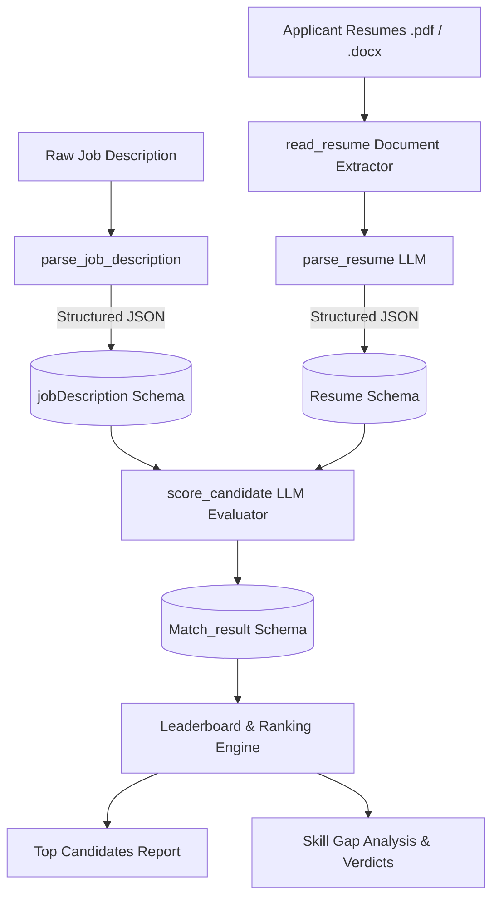

# 📄 LLM Resume Reviewer

<div align="center">

[](https://www.python.org/)
[](https://groq.com/)
[](https://docs.pydantic.dev/)
[](LICENSE)
[]()

**An automated, schema-enforced AI resume evaluation and ranking pipeline powered by Groq and Pydantic.**

[Features](#-key-features) • [Workflow](#-architecture--workflow) • [Quick Start](#-quick-start) • [Schema Design](#-schema-definitions) • [Sample Output](#-sample-evaluation-output)

</div>

---

## 📌 Overview

**LLM Resume Reviewer** is an intelligent candidate evaluation pipeline designed to bridge the gap between job descriptions and incoming applicant resumes. 

Using high-throughput Large Language Models via Groq and strict schema validation with **Pydantic v2**, the system ingests resumes in `.pdf` and `.docx` formats, extracts semantic competencies, evaluates required vs. preferred qualifications, and produces ranked recruiter reports with match percentages, skill gap breakdowns, and actionable hiring verdicts.

---

## 🚀 Key Features

- **Multi-Format Ingestion**: Native extraction from both `.pdf` (via `pypdf`) and `.docx` (via `python-docx`) documents.
- **Strict Schema Enforcement**: Utilizes Pydantic blueprints (`jobDescription`, `Resume`, `Match_result`) ensuring deterministic, structured JSON output from the LLM.
- **Semantic Candidate Matching**: Evaluates candidates based on domain context, experience, and competencies rather than brittle keyword matching.
- **Skill Gap & Fit Analysis**: Identifies exact matching skills, critical missing qualifications, and experience requirement adherence.
- **Automated Leaderboard & Ranking**: Sorts and displays top-performing and lowest-performing candidates with full scoring rationales.
- **Production-Grade Resilience**: Built-in exponential backoff and rate-limit handling (`call_groq_json`) to ensure uninterrupted batch processing on free and enterprise LLM tiers.

---

## 🏗 Architecture & Workflow



---

## 📂 Project Structure

```bash
LLM-Resume-Reviewer/
├── evaluator.py        # Core evaluation pipeline, schemas, & scoring engine
├── main.py             # Project entrypoint
├── pyproject.toml      # Project configuration & dependencies managed by uv
├── .env.example        # Environment variable template
├── .gitignore          # Security rules preventing leaks of keys & resumes
├── README.md           # Documentation
└── resume/             # (Ignored) Directory for incoming applicant resumes
```

---

## ⚡ Quick Start

### 1. Prerequisites
- Python **3.11+**
- A **Groq API Key** (Free from [console.groq.com](https://console.groq.com))
- [`uv`](https://github.com/astral-sh/uv) (recommended) or standard `pip`

### 2. Clone the Repository
```bash
git clone https://github.com/aryan-Kuldeep/LLM-Resume-Reviewer.git
cd LLM-Resume-Reviewer
```

### 3. Setup Virtual Environment & Install Dependencies
Using `uv`:
```bash
uv venv --python 3.11
source .venv/bin/activate
uv sync
```
*Or with standard pip:*
```bash
python -m venv .venv
source .venv/bin/activate
pip install -r requirements.txt
```

### 4. Configure Environment Variables
Copy `.env.example` to `.env` and insert your API key:
```bash
cp .env.example .env
```
Edit `.env`:
```env
GROQ_API_KEY=gsk_your_actual_api_key_here
```

### 5. Add Resumes & Run Evaluation
1. Create a `resume` folder and place candidate `.pdf` or `.docx` files inside:
   ```bash
   mkdir -p resume
   # Add your resumes into resume/
   ```
2. Execute the evaluator:
   ```bash
   python evaluator.py
   ```

---

## 🧬 Schema Definitions

### 1. `jobDescription`
```python
class jobDescription(BaseModel):
    role: str
    required_skills: list[str]
    preffered_skills: list[str]
    minimum_experience: float | None
    educational_requirement: list[str]
    responsibilities: list[str]
```

### 2. `Resume`
```python
class Resume(BaseModel):
    name: str | None
    email: str | None
    phone: str | None
    total_experience_year: float | None
    skills: list[str] = []
    experiences: list[str] = []
    projects: list[str] = []
    certifications: list[str] = []
```

### 3. `Match_result`
```python
class Match_result(BaseModel):
    score: float
    details: dict
```

---

## 📊 Sample Evaluation Output

```json
================ TOP CANDIDATE ================
Alex Rivera - 92.0%
{
  "candidate_name": "Alex Rivera",
  "matching_skills": [
    "Machine Learning",
    "Algorithm Development",
    "Statistical Data Analysis",
    "Technical Communication",
    "Data Visualization",
    "NLP",
    "Computer Vision"
  ],
  "missing_important_skills": [],
  "experience_requirement_met": true,
  "overall_match_percentage": 92.0,
  "final_verdict": "Strong fit – meets all required skills and preferred qualifications."
}
```

---

## 🔒 Security & Privacy

- **Data Privacy**: Candidate resumes located in `resume/` are strictly ignored by `.gitignore` and are never committed to version control.
- **Credentials Protection**: API keys and environment files (`.env`, `.env.*`) are permanently excluded from tracking.

---

## 📜 License

This project is licensed under the MIT License - see the [LICENSE](LICENSE) file for details.
